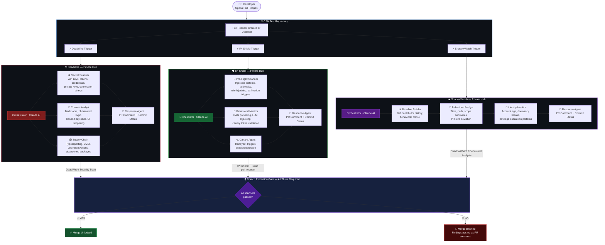

<div align="center">

# 🔬 Cyber Agentic Network — Test Repository

### Autonomous, AI-native code security. Zero human reviewers. No exceptions.

**Three independent AI security systems intercept every pull request in parallel — scanning for secrets, prompt injection, and insider threats — before a single line reaches production.**

[](./LICENSE)
[](https://github.com/RainFirestorm/deadwire)
[](https://github.com/RainFirestorm/ipi-shield)
[](https://github.com/RainFirestorm/shadow-watch)
[](https://anthropic.com)

</div>

---

## Why This Exists — The Control Gap

Most security teams have tooling for infrastructure and endpoints. The software supply chain is a different problem: **every merged pull request is a potential entry point**, and traditional controls — peer review, static analysis, dependency scanners — are reactive, inconsistent, and don't scale to AI-assisted development velocity.

The **Cyber Agentic Network (CAN)** closes three specific control gaps simultaneously:

| Risk | What Fails Today | CAN Control |
|------|-----------------|-------------|
| **Credential & secret exposure** | Manual review misses obfuscated keys, entropy patterns, CI injection | ☠️ DeadWire — automated secret + backdoor + supply chain scan on every commit |
| **LLM prompt injection in codebases** | No existing tooling detects injection payloads embedded in PR content | 🛡️ IPI Shield — pre-flight + behavioral + canary agent scan before merge |
| **Insider threat & account compromise** | No baseline = no deviation detection; alerts come after damage | 👁️ ShadowWatch — 90-day behavioral profile, real-time anomaly scoring per contributor |

All three run **autonomously, in parallel, under 2 minutes**. A single failure blocks merge. No override path without removing branch protection.

---

## The Triple Security Gate — Live

Every pull request to this repository triggers all three scanners simultaneously via `repository_dispatch`. All three must post a passing commit status before merge is permitted.



> 💡 **Zoom / Export SVG:** Copy the diagram source above and paste it into [Mermaid Live Editor →](https://mermaid.live/edit)

**Typical gate time: under 2 minutes from PR open to all three results posted.**

---

## What Each Scanner Detects

### ☠️ DeadWire — Code & Commit Security

| Detection | Examples |
|-----------|---------|
| **Exposed Secrets** | AWS keys, API tokens, private keys, connection strings, JWTs |
| **Backdoors** | Base64-encoded payloads, obfuscated exec calls, C2 callbacks |
| **Supply Chain Attacks** | Typosquatted packages, Unicode lookalike names, CVE-flagged versions |
| **CI/CD Tampering** | Unpinned GitHub Action SHAs, suspicious workflow modifications |
| **Commit Anomalies** | Message/diff mismatch, credential passed to subprocess |

### 🛡️ IPI Shield — LLM Runtime Security

| Detection | Examples |
|-----------|---------|
| **Prompt Injection** | Hidden instructions in PR content, document metadata, tool outputs |
| **Role Hijacking** | "Ignore previous instructions", DAN/jailbreak patterns |
| **Data Exfiltration** | Payloads triggering context forwarding to attacker infrastructure |
| **Behavioral Hijacking** | Instructions that modify LLM response format or identity |
| **Encoding Attacks** | Zero-width character smuggling, base64 instruction injection |

### 👁️ ShadowWatch — Behavioral Intelligence

| Detection | Examples |
|-----------|---------|
| **New Sensitive Path Access** | Contributor touching `auth/`, `secrets/`, `.github/` for the first time |
| **Multi-Category Sensitive Access** | auth + config + deploy touched in a single PR — privilege escalation pattern |
| **Unusual Commit Time** | Commit at an hour accounting for <5% of contributor's historical activity |
| **Broad Scope Expansion** | 3+ new directories touched simultaneously |
| **New or Dormant Account** | GitHub account <30 days old, or long-dormant account suddenly active |
| **New Contributor** | No prior commit history — behavioral baseline cannot be established |

---

## Branch Protection

All three status checks are **required** before any PR can merge:

| Check | Scanner | Failure Action |
|-------|---------|---------------|
| `DeadWire / Security Scan` | DeadWire Hub | Merge blocked + findings comment |
| `IPI Shield — scan pull_request` | IPI Shield Hub | Merge blocked + findings comment |
| `ShadowWatch / Behavioral Analysis` | ShadowWatch Hub | Merge blocked + findings comment |

If any check reports `failure`, the merge button is disabled regardless of approvals. Findings are posted as a detailed PR comment identifying exactly what was detected, which file or signal triggered it, and why it was flagged — including AI-generated reasoning from the scanner that fired.

---

## Live Demo Scenarios

The [`demos/`](./demos/) folder contains three ready-to-run payloads that exercise every detection path. Use the built-in **one-click launcher** to fire any scenario instantly — no manual branch creation required.

### How to Run

**Actions → 🎯 Run Demo Scenario → Run workflow → pick a scenario**

> Note: Running the demo launcher requires write access to this repository.

| # | Scenario | DeadWire | IPI Shield | ShadowWatch | Attack Vectors |
|---|----------|:--------:|:----------:|:-----------:|----------------|
| 1 | [DeadWire — Code Analysis](./demos/scenario-1-deadwire/) | 🔴 CRITICAL | ✅ Clean | ✅ Clean | Hardcoded AWS credential + base64 backdoor + typosquatted supply chain |
| 2 | [IPI Shield — Content Analysis](./demos/scenario-2-ipi-shield/) | ✅ Clean | 🔴 CRITICAL | ✅ Clean | Poisoned RAG document — DAN jailbreak + role hijacking + exfiltration trigger |
| 3 | [ShadowWatch — Behavioral Analysis](./demos/scenario-3-shadowwatch/) | ✅ Clean | ✅ Clean | 🔴 CRITICAL | Multi-category sensitive path access — auth + config + deploy simultaneously |
| 4 | [Full CAN — All Three Scanners](./demos/scenario-4-full-scan/) | 🔴 CRITICAL | 🔴 CRITICAL | 🔴 CRITICAL | All attack vectors: prompt injection + exposed AWS credential + sensitive path access |

Each scenario opens a real PR, fires all three scanners in parallel, and produces live findings reports. Merge is automatically blocked on every scenario that should fail.

---

## Architecture: Hub & Spoke

The platform uses a **hub-and-spoke model** to keep security logic separate from the repositories it protects:

```
  [Any Target Repo]
       │
       │  repository_dispatch (webhook)
       │  ← carries: diff, PR number, commit SHA
       ▼
  [Scanner Hub] ← private, holds API keys and detection logic
       │
       │  POST commit status back to target repo
       │  POST PR comment to target repo
       ▼
  [Branch Protection Gate on Target Repo]
```

**This means:**
- The target repo holds zero detection logic and zero API keys
- Scanner hubs are private — attackers cannot read the detection patterns
- Any repository can be protected by pointing trigger workflows at the hubs
- Cost for the target repo: **$0** — all Claude inference runs in the private hubs

---

## Security Notice for Public Viewers

This is a **public demonstration repository**. The scanner hubs (DeadWire, IPI Shield, ShadowWatch) that this repo dispatches to are **private**. Only authorized repositories can trigger scans — an allowlist in each scanner hub rejects all other dispatch events before any compute cost is incurred.

If you open a pull request against this repository as an outside contributor, workflows will not run without maintainer approval.

---

## Commercial Licensing

> **This repository demonstrates a reference architecture only.**

The full Cyber Agentic Network platform — including production-grade scanner engines, tuned detection models, enterprise orchestration, multi-repo deployment, SIEM integration, and commercial support — is proprietary and available under a separate commercial license.

**Use cases that require a commercial agreement:**

- Deploying the scanner hubs (DeadWire, IPI Shield, ShadowWatch) in your organization
- Accessing the private agent repositories or production configurations
- Integrating CAN into enterprise CI/CD pipelines at scale
- White-labeling or redistributing the platform
- Receiving SLA-backed support and custom detection tuning

For licensing inquiries, enterprise deployment discussions, or partnership opportunities, reach out via **[github.com/RainFirestorm](https://github.com/RainFirestorm)**.

---

## Platform Pillars

| Network | Attack Surface | Status |
|---------|---------------|--------|
| ☠️ **DeadWire** | Code & commits — secrets, backdoors, supply chain | ✅ Live |
| 🛡️ **IPI Shield** | LLM runtime — prompt injection, behavioral hijacking | ✅ Live |
| 👁️ **ShadowWatch** | Identity & behavior — insider threats, anomalous access patterns | ✅ Live |

---

<div align="center">

*Built to catch what static scanners miss.*

[](./LICENSE)

[DeadWire](https://github.com/RainFirestorm/deadwire) · [IPI Shield](https://github.com/RainFirestorm/ipi-shield) · [ShadowWatch](https://github.com/RainFirestorm/shadow-watch) · [Commercial Licensing](#commercial-licensing)

</div>
